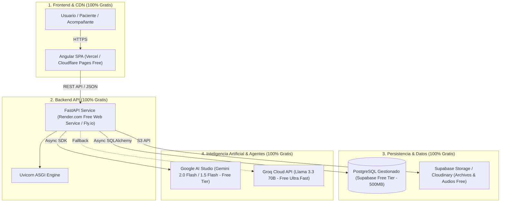
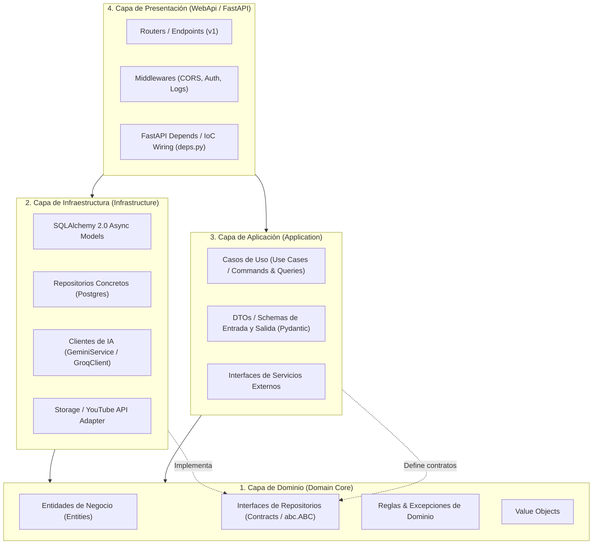
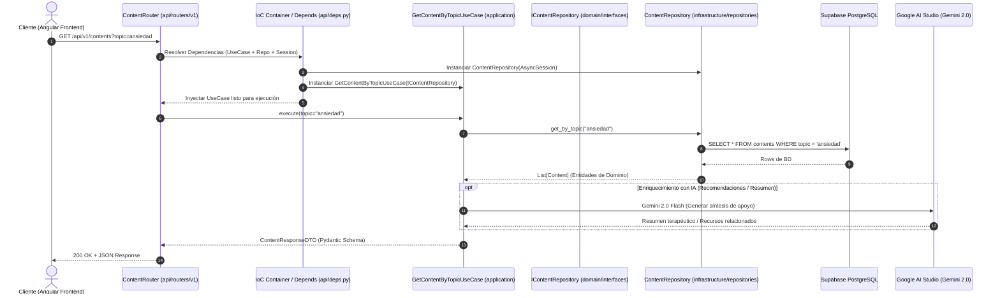

# PRESENTE - Arquitectura Limpia y Diseño Técnico (Clean Architecture & $0 Cost Stack)

Este documento define la arquitectura técnica del proyecto **PRESENTE**, implementando el paradigma de **Clean Architecture (Onion / Hexagonal)** con **Inversión de Control (IoC)** en Python (**FastAPI**) + **Angular**, adaptado del modelo de referencia .NET del proyecto **Million**, y optimizado para ejecutarse en capas **100% gratuitas ($0 USD)**.

---

## 1. Topología del Ecosistema de Despliegue ($0 Cost Stack)

Para garantizar la viabilidad del proyecto sin generar costos operativos ni gastos mensuales en servidores o tokens de IA, se adopta la siguiente arquitectura de despliegue en capas gratuitas:



---

## 2. Diagrama de Capas: Clean Architecture (Onion Pattern)

La arquitectura sigue estrictamente la **Regla de Dependencia**: las capas externas conocen a las internas, pero el núcleo de Dominio nunca conoce librerías de infraestructura, frameworks ni bases de datos.



---

## 3. Flujo de Inversión de Control (IoC) y Ciclo de Vida de una Petición

El siguiente diagrama de secuencia ilustra cómo la Inversión de Control desacopla la petición HTTP del acceso a datos, pasando por los casos de uso y resolviendo las dependencias en tiempo de ejecución:



---

## 4. Tabla de Mapeo: .NET (`Million`) ➔ Python (`FastAPI`)

| Concepto Arquitectónico | Proyecto .NET (`Million`) | Proyecto Python (`Present`) | Rol / Responsabilidad |
| :--- | :--- | :--- | :--- |
| **Entidades de Dominio** | `Million.Domain.Entities/*.cs` | `src/domain/entities/*.py` | Modelos de negocio puros sin dependencias de ORM. |
| **Interfaces de Repositorio** | `Million.Domain.Interfaces/IRepository.cs` | `src/domain/interfaces/i_repository.py` | Contratos abstractos (`abc.ABC`) que definen operaciones de persistencia. |
| **Excepciones de Negocio** | `Million.Domain.Exceptions/*.cs` | `src/domain/exceptions/*.py` | Excepciones personalizadas para reglas de negocio. |
| **Casos de Uso / Servicios App** | `Million.Application.Services/*.cs` | `src/application/use_cases/*.py` | Orquestación de lógica de negocio por cada feature/acción. |
| **DTOs (Data Transfer Objects)** | `Million.Application.DTOs/*.cs` | `src/application/dtos/*.py` | Esquemas Pydantic para validar payloads de entrada y serializar salidas. |
| **Modelos de Base de Datos** | `Million.Infra.Data/Context/*.cs` | `src/infrastructure/database/models/*.py` | Modelos ORM de SQLAlchemy 2.0 mapeados a tablas de PostgreSQL. |
| **Implementación de Repositorios**| `Million.Infra.Data/Repositories/*.cs` | `src/infrastructure/repositories/*.py`| Implementaciones con consultas SQL async que cumplen `IRepository`. |
| **Inversión de Control (IoC)** | `Million.Infra.IoC/DependencyContainer.cs`| `src/core/container.py` + `src/api/deps.py` | Registro y resolución de dependencias (Singleton, Scoped, Factory). |
| **Controladores / Routers** | `Million.WebApi/Controllers/*.cs` | `src/api/routers/v1/*.py` | Endpoints HTTP con decoradores `@router.get/post`. |
| **Punto de Entrada & Middleware** | `Million.WebApi/Program.cs` | `src/api/main.py` | Configuración de FastAPI, CORS, Lifespan y Middlewares. |
| **Pruebas Unitarias & Integración**| `Million.Test/*.cs` (xUnit/NUnit) | `tests/unit/`, `tests/integration/` (pytest) | Suite de pruebas automatizadas con mocks de interfaces. |

---

## 5. Estructura de Directorios del Repositorio `present`

```
present/
├── .agents/                            # BMad Skills y Configuración de Agentes
├── _bmad/                              # Pipelines y Memlogs BMad
├── docs/                               # Documentación y Propuesta MVP
│   ├── present-mvp-proposal.md
│   └── architecture-clean-architecture.md
│
├── src/                                # Código Fuente Principal
│   ├── domain/                         # CAPA 1: DOMAIN
│   │   ├── __init__.py
│   │   ├── entities/
│   │   │   ├── content.py              # Entidad de contenido multiformato
│   │   │   ├── user.py                 # Entidad de usuario y perfil
│   │   │   └── accompaniment.py        # Entidad de sesión de acompañamiento
│   │   ├── interfaces/
│   │   │   ├── i_content_repository.py # Contrato abstracto
│   │   │   └── i_user_repository.py
│   │   └── exceptions/
│   │       └── domain_exceptions.py
│   │
│   ├── application/                    # CAPA 3: APPLICATION
│   │   ├── __init__.py
│   │   ├── dtos/
│   │   │   ├── content_dto.py          # Schemas Pydantic In/Out
│   │   │   └── user_dto.py
│   │   ├── interfaces/
│   │   │   └── i_ai_service.py         # Contrato para servicios de IA
│   │   └── use_cases/
│   │       ├── get_contents.py
│   │       ├── create_content.py
│   │       └── generate_therapeutic_summary.py
│   │
│   ├── infrastructure/                 # CAPA 2: INFRASTRUCTURE
│   │   ├── __init__.py
│   │   ├── database/
│   │   │   ├── session.py              # Async Engine SQLAlchemy (Postgres)
│   │   │   └── models/
│   │   │       ├── content_model.py
│   │   │       └── user_model.py
│   │   ├── repositories/
│   │   │   ├── content_repository.py   # Implementa IContentRepository
│   │   │   └── user_repository.py
│   │   └── external/
│   │       ├── gemini_ai_client.py     # Integración Google AI Studio
│   │       └── supabase_storage.py
│   │
│   ├── core/                           # NÚCLEO TRANSVERSAL & IOC
│   │   ├── __init__.py
│   │   ├── config.py                   # Settings (pydantic-settings)
│   │   └── container.py                # Contenedor IoC
│   │
│   └── api/                            # CAPA 4: PRESENTATION (WEBAPI)
│       ├── __init__.py
│       ├── main.py                     # App FastAPI & Lifespan
│       ├── deps.py                     # Provider de dependencias (FastAPI Depends)
│       ├── middlewares/
│       │   └── error_handler.py
│       └── routers/
│           ├── __init__.py
│           └── v1/
│               ├── content_router.py
│               └── health_router.py
│
├── tests/                              # CAPA 5: PRUEBAS
│   ├── conftest.py
│   ├── unit/
│   └── integration/
│
├── .env.example                        # Plantilla de variables de entorno
├── pyproject.toml                      # Dependencias (Poetry / Pip / UV)
└── README.md
```

---

## 6. Estrategia de IA Gratuita (Tokens & Fallback)

Para operar la iniciativa de salud mental sin presupuesto de APIs:
1. **Google AI Studio (Gemini 2.0 Flash / 1.5 Flash)**:
   - Proveedor primario mediante API Key gratuita.
   - Ventana de contexto de 1,000,000 de tokens por llamada.
   - Capacidad multimodal (texto, audio, imagen, documentos).
2. **Groq Cloud (Llama 3.3 70B)**:
   - Proveedor secundario / fallback automático si se alcanza el rate limit por minuto.
   - Latencia < 500ms para generación de respuestas en tiempo real.
3. **Respaldo Local (Ollama)**:
   - Para desarrollo sin conexión a internet ejecutando modelos ligeros (Qwen 2.5 Coder o Llama 3.1).
