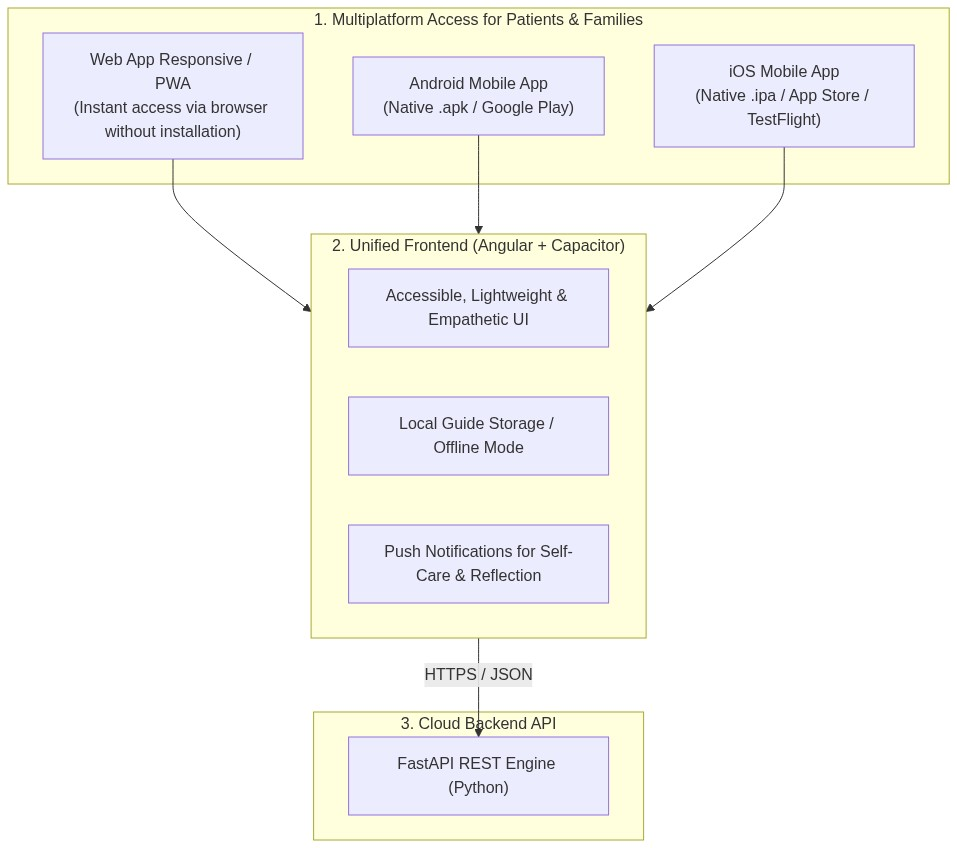
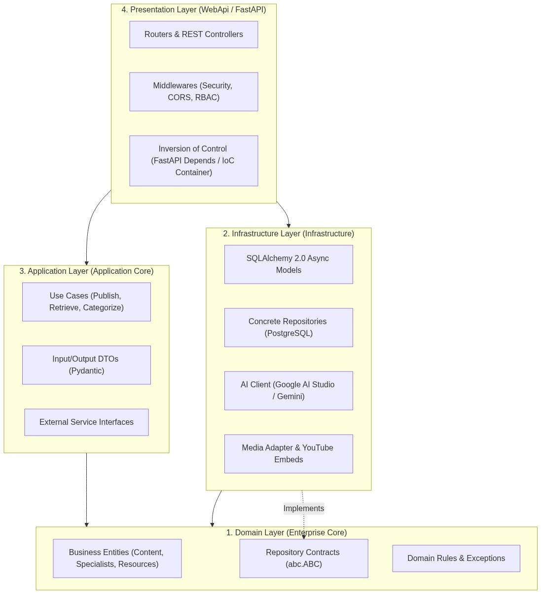
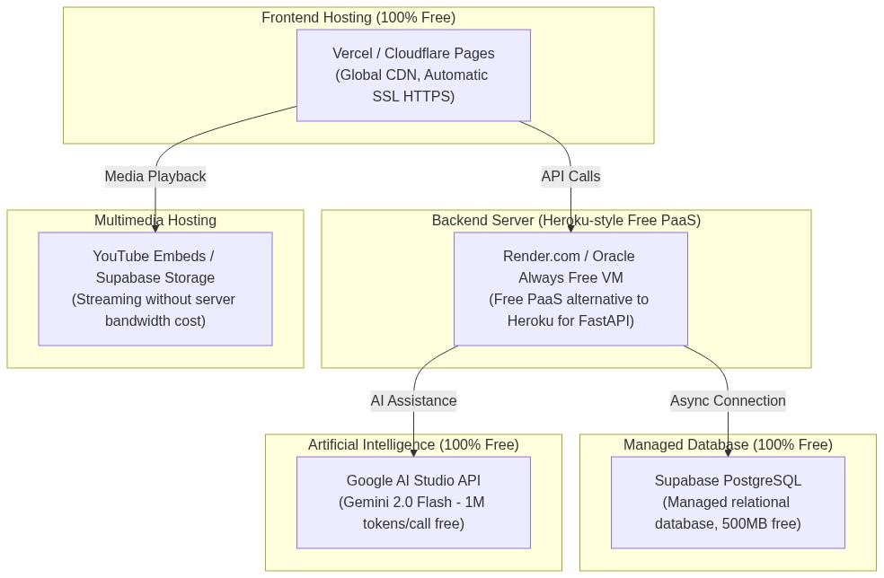

# PRESENTE
### Iniciativa digital de acompañamiento en salud mental
**PRESENTE - Y RECUERDA QUE NO ESTAMOS SOLOS**  
*Propuesta de iniciativa y desarrollo de MVP*  
**Autor:** Cristian Camilo Rojas Estrada  
**Fecha:** 2026-08-07  
**Institución Colaboradora Propuesta:** Clínica San Juan de Dios de Manizales  
**Documento Canónico Base (Inglés):** [`docs/present-mvp-proposal.md`](./present-mvp-proposal.md)

---

## Introducción

La salud mental forma parte de la vida de todas las personas.

A lo largo de la vida podemos atravesar momentos de ansiedad, tristeza, incertidumbre, soledad, pérdidas, conflictos, cambios importantes, dificultades familiares, preocupaciones personales o diferentes situaciones que pueden afectar nuestra manera de sentir, pensar y relacionarnos con nuestro entorno.

Cada persona vive estas experiencias de una manera diferente.

Algunas personas buscan acompañamiento profesional. Otras encuentran refugio en su familia, amigos, comunidad o espiritualidad. Algunas no saben cómo pedir ayuda. Otras se encuentran atravesando un proceso de salud mental y necesitan continuar fortaleciendo las herramientas adquiridas. También existen personas que han buscado acompañamiento en diferentes momentos y sienten que todavía necesitan encontrar nuevas formas de afrontar lo que están viviendo.

Hay quienes ya finalizaron un proceso de atención y necesitan continuar fortaleciendo lo aprendido. También existen personas que todavía se encuentran atravesando una situación difícil y aún no han iniciado un proceso de acompañamiento profesional, aunque podrían beneficiarse de hacerlo.

En muchos casos puede aparecer una sensación de aislamiento, incomprensión o falta de herramientas para continuar.

De esta realidad nace **PRESENTE**, una iniciativa que busca utilizar la tecnología como medio para acompañar ese transitar en salud mental, acercando conocimiento, experiencias y herramientas a todas las personas que puedan encontrar valor en ellas.

La iniciativa surge desde una perspectiva tecnológica y social. La propuesta consiste en desarrollar una plataforma digital independiente que permita organizar, producir, publicar y distribuir contenidos de manera sencilla, accesible y responsable.

El proyecto parte de una convicción:
Atravesar un momento de sufrimiento no define a una persona. Una situación difícil puede formar parte de una etapa de la vida y, con acompañamiento, conocimiento y herramientas adecuadas, pueden encontrarse nuevos caminos.

PRESENTE busca convertirse en un punto de encuentro digital donde una persona pueda encontrar una conversación, una reflexión, una herramienta, una experiencia o una palabra de aliento que le permita sentirse acompañada y encontrar un poco de luz en su camino.

**PRESENTE - Y RECUERDA QUE NO ESTAMOS SOLOS.**

---

## 1. Origen de la iniciativa

La idea tiene como punto de partida la experiencia de personas relacionadas con procesos de atención en salud mental y, particularmente, la reflexión sobre lo que ocurre después de finalizar una hospitalización, un programa de atención o un proceso terapéutico.

Una pregunta inicial dio origen al proyecto:
**¿Qué pasa después?**

Después de salir de un proceso de atención, una persona puede volver a su entorno cotidiano y encontrarse nuevamente con sus responsabilidades, relaciones, preocupaciones y dificultades.

Puede necesitar:
* Continuar fortaleciendo herramientas.
* Recordar algo que aprendió durante su proceso.
* Escuchar una experiencia.
* Recibir una palabra de aliento.
* Encontrar un espacio al cual regresar.
* Reconocer señales que indiquen que necesita nuevamente acompañamiento.
* Continuar construyendo hábitos y redes de apoyo.

Sin embargo, la reflexión llevó a ampliar la pregunta:
* ¿Qué ocurre con las personas que todavía no buscan ayuda?
* ¿Qué ocurre con quienes se encuentran encerradas en sí mismas?
* ¿Qué ocurre con quienes están atravesando una situación difícil pero no saben si necesitan iniciar un proceso terapéutico?
* ¿Qué ocurre con quienes han atravesado diferentes procesos y sienten que todavía no encuentran bienestar?
* ¿Qué ocurre con un familiar que no sabe cómo acompañar?
* ¿Qué ocurre con alguien que simplemente está atravesando una etapa difícil de su vida?

La respuesta llevó a una visión más amplia.
La iniciativa no busca únicamente acompañar a quienes ya han pasado por un proceso de atención. También busca acercar información, herramientas y perspectivas que puedan ayudar a una persona a reconocer que necesita apoyo y, cuando sea necesario, incentivar la búsqueda de acompañamiento profesional.

PRESENTE no pretende determinar cuándo una persona necesita terapia ni realizar evaluaciones clínicas. Su propósito es que, mediante contenidos responsables, una persona pueda encontrar información que le permita comprender mejor una situación, reconocer la importancia de pedir ayuda y considerar el inicio o continuidad de un proceso terapéutico cuando sea apropiado, además de construir una red de apoyo para todos.

---

## 2. Concepto de PRESENTE

El nombre PRESENTE representa el propósito central de la iniciativa. Estar presente significa acompañar el momento que una persona está viviendo; no significa tener todas las respuestas o solucionar el sufrimiento de otra persona. Significa poner a su alcance un espacio donde pueda encontrar conocimiento, herramientas, experiencias y diferentes perspectivas.

PRESENTE busca transmitir que una persona no está definida por la situación que atraviesa. Una persona puede estar:
* Atravesando una situación difícil.
* Recuperándose después de un proceso.
* Buscando comprender lo que siente.
* Acompañando a alguien cercano.
* Considerando iniciar terapia.
* Continuando un proceso terapéutico.
* Buscando herramientas para su vida cotidiana.
* Simplemente interesada en cuidar mejor su salud mental.

Por eso, la plataforma no estará dirigida exclusivamente a personas que se identifiquen como pacientes. Está dirigida a personas. El propósito es que cualquier persona pueda encontrar contenidos que le resulten significativos, sin importar el momento particular de su vida en el que llegue a la plataforma.

**PRESENTE - Y RECUERDA QUE NO ESTAMOS SOLOS.**  
El eslogan resume la intención de la iniciativa: PRESENTE representa acompañamiento. Y RECUERDA QUE NO ESTAMOS SOLOS representa la idea de que las dificultades pueden atravesarse con apoyo, conocimiento, vínculos y herramientas.

---

## 3. Propósito

Crear una plataforma digital accesible para todos que acerque contenidos relacionados con salud mental, acompañamiento y bienestar, desarrollados y publicados por profesionales y colaboradores autorizados.

La plataforma utilizará la tecnología para:
* Organizar el conocimiento.
* Facilitar el acceso a contenidos.
* Distribuir diferentes formatos.
* Acercar la perspectiva de profesionales y colaboradores.
* Ofrecer herramientas y recursos.
* Presentar diferentes experiencias y perspectivas.
* Construir una comunidad alrededor de los contenidos.
* Facilitar que una misma pieza de contenido pueda llegar a diferentes públicos y plataformas.
* Incentivar la búsqueda de acompañamiento profesional cuando los contenidos indiquen que puede ser necesario.

El proyecto combinará: conocimiento profesional, sensibilidad humana y tecnología.

La plataforma tendrá como función acercar contenidos, conocimientos, experiencias y herramientas desarrollados por personas con conocimientos o experiencia pertinente, de manera comprensible y responsable, no pretende convertirse en un centro educativo ni reemplazar la terapia profesional.

---

## 4. Objetivo general

Construir PRESENTE, una plataforma digital que facilite el acceso a contenidos relacionados con salud mental, bienestar y enviar un mensaje de compañía, mediante una arquitectura tecnológica que permita administrar, organizar y distribuir información elaborada por profesionales y colaboradores autorizados.

---

## 5. Objetivos específicos

* Desarrollar un MVP funcional de una plataforma digital orientada al acompañamiento y a la divulgación de contenidos relacionados con salud mental.
* Facilitar el acceso a contenidos audiovisuales, audio, textos, imágenes y documentos.
* Organizar los contenidos por temas, formatos y perfiles de publicación.
* Crear un sistema de administración de contenidos que permita controlar quién puede publicar y qué contenido puede ser publicado.
* Integrar diferentes canales digitales, inicialmente la plataforma web, YouTube y redes sociales.
* Crear una experiencia sencilla y accesible, especialmente para personas que pueden estar atravesando momentos de dificultad, cansancio o poca concentración.
* Incorporar contenidos de diferentes áreas, incluyendo psicología, bienestar, espiritualidad, pastoral y experiencias personales debidamente seleccionadas.
* Promover y reconocer la importancia de los procesos terapéuticos y ayuda profesional cuando una persona pueda necesitarlos bien sea iniciar o continuarlos.
* Construir progresivamente una comunidad de usuarios, entendida como un conjunto de personas que acceden, encuentran valor e interactúan alrededor de contenidos previamente seleccionados y publicados.
* Establecer criterios de seguridad, privacidad y moderación desde las primeras etapas del desarrollo.
* Validar el MVP antes de realizar inversiones o desarrollar funcionalidades de mayor complejidad.

---

## 6. La tecnología como valor agregado

Uno de los elementos diferenciadores de PRESENTE es que la iniciativa no se limita a la producción de contenido. El proyecto contempla la creación de una plataforma tecnológica independiente, desarrollada para organizar, administrar y distribuir los contenidos de la iniciativa.

La tecnología permitirá convertir diferentes contenidos en un sistema organizado y accesible. Por ejemplo, una conversación entre un psicólogo y un líder de pastoral podría convertirse en:
* Episodio de video.
* Episodio de audio.
* Fragmentos para redes sociales.
* Resumen o escrito.
* Material complementario.
* Recursos descargables.
* Contenido relacionado dentro de la plataforma.

La plataforma permitirá organizar estos recursos para que una persona no tenga que buscarlos en diferentes lugares. La tecnología será utilizada como medio para amplificar el conocimiento y el acompañamiento, no como un fin en sí mismo.

El valor tecnológico del proyecto estará también en la posibilidad de crear una infraestructura que permita:
* Administrar contenidos.
* Gestionar colaboradores.
* Establecer roles y permisos.
* Controlar publicaciones.
* Organizar diferentes formatos.
* Integrar servicios externos.
* Distribuir contenidos.
* Obtener información básica sobre el uso de la plataforma.
* Evolucionar progresivamente hacia nuevas funcionalidades.

---

## 7. Arquitectura conceptual de la plataforma

La primera versión estará diseñada como una aplicación web accesible desde computadores y dispositivos móviles. Conceptualmente, el sistema estará compuesto por:
* **Capa de presentación:** Una interfaz web sencilla y responsive que permita acceder a los contenidos desde diferentes dispositivos.
* **Capa de aplicación:** Un backend encargado de gestionar usuarios autorizados, contenidos, categorías, publicaciones y demás funcionalidades de la plataforma.
* **Capa de información:** Una base de datos donde se almacenen los datos estructurados de la plataforma.
* **Gestión de contenidos:** Un sistema que permita crear, editar, revisar, publicar, actualizar y retirar contenidos.
* **Gestión de usuarios y permisos:** Un sistema basado en roles que determine qué puede hacer cada tipo de usuario dentro de la plataforma.
* **Integración multimedia:** Los contenidos audiovisuales podrán alojarse inicialmente en plataformas especializadas como YouTube, mientras que PRESENTE podrá organizarlos y presentarlos de manera estructurada.
* **Distribución:** La plataforma podrá relacionarse con redes sociales y otros canales para ampliar el alcance de los contenidos.

La arquitectura se diseñará de manera que pueda comenzar siendo pequeña y evolucionar progresivamente si la iniciativa demuestra tener aceptación.

---

## 8. Modelo de publicación y control de contenidos

La comunidad de PRESENTE no se plantea como una red social de publicación abierta. Por la naturaleza de la iniciativa, los contenidos deberán mantener criterios de responsabilidad, pertinencia y calidad. Por esta razón, se propone desde el MVP un modelo de publicación controlado mediante roles.

* **Administrador:** Tendrá permisos para:
   * Administrar usuarios.
   * Administrar categorías.
   * Revisar contenidos.
   * Publicar o retirar contenidos.
   * Gestionar permisos.
   * Administrar la plataforma.
   * Moderar las interacciones habilitadas.
* **Publicador autorizado:** Podrá crear y administrar los contenidos que le hayan sido asignados, de acuerdo con sus permisos (líderes de pastoral, psicólogos, psiquiatras, terapeutas ocupacionales, colaboradores autorizados).
* **Usuario:** Podrá consultar contenidos, reproducir audio/video, leer materiales, descargar recursos autorizados y explorar categorías.

El usuario no tendrá inicialmente permisos para crear publicaciones abiertas, subir archivos ni enviar mensajes privados a otros usuarios o profesionales. Esto permite mantener una plataforma sencilla, ordenada y segura, reduciendo además las necesidades de moderación y administración.

---

## 9. Comunidad PRESENTE

La comunidad constituye uno de los componentes centrales de la iniciativa, pero no se plantea como una red social de publicación abierta. PRESENTE busca construir un espacio digital en el cual se podrán encontrar contenidos responsables, conversaciones y herramientas provenientes de profesionales y colaboradores previamente autorizados.

La generación de contenido estará centralizada en perfiles profesionales y colaboradores autorizados. Las personas que utilizan la plataforma podrán interactuar con estos contenidos mediante mecanismos definidos y controlados (comentarios moderados, reacciones, participación en actividades guiadas).

---

## 10. Propuesta inicial de contenidos

* **Psicología y salud mental:** Promoción de procesos terapéuticos, búsqueda de ayuda, comprensión de emociones, higiene del sueño, manejo de crisis y herramientas cotidianas.
* **Espiritualidad y pastoral:** Sentido de vida y propósito, esperanza, reflexiones, oración y acompañamiento en el dolor desde un marco de respeto y diversidad.
* **Bienestar y Terapia Ocupacional:** Meditación, respiración, descanso, hábitos saludables, actividad física, autocuidado y arte.
* **Conversaciones:** Entrevistas y podcasts con profesionales y colaboradores.
* **Experiencias:** Testimonios voluntarios previamente seleccionados y gestionados de manera responsable.

---

## 11. Estrategia multimedia

Un contenido no necesariamente tendrá que existir en un único formato. Una misma sesión o conversación puede distribuirse como: Podcast completo, Video en YouTube, Audio para escuchar en ruta, Clips cortos para redes y Guías prácticas en PDF.

---

## 12. Redes sociales

Las redes sociales serán un canal de descubrimiento (TikTok y YouTube Shorts para alcance inicial; YouTube para contenidos largos; y la plataforma PRESENTE como hogar estructurado para profundizar).

---

## 13. Experiencia de usuario (UX)

La experiencia deberá ser intuitiva, con lenguaje claro, pocos pasos, alto contraste y navegación guiada por la intención (*"¿Qué buscas hoy?: Quiero escuchar, Quiero una herramienta, Quiero una reflexión, Quiero acompañar a alguien"*).

---

## 14. Relación con profesionales e instituciones

La iniciativa podrá establecer relaciones de colaboración con profesionales e instituciones. **La Clínica San Juan de Dios de Manizales representa la incubadora y primer espacio de colaboración** debido al vínculo existente con profesionales y personas relacionadas con procesos de salud mental.

Sin embargo, PRESENTE se plantea como una iniciativa independiente. La colaboración con la institución no implica que la plataforma sea propiedad de dicha institución ni limitará su posibilidad de colaborar con otros actores interesados en el futuro.

---

## 15. Principios de contenido

Responsabilidad, Respeto, Humanidad, Diversidad, Conocimiento responsable, Privacidad e Incentivo constante a buscar ayuda profesional.

---

## 16. Alcance y límites

PRESENTE será una plataforma de acompañamiento y psicoeducación. **No diagnostica, no reemplaza la psicoterapia ni la atención médica de urgencias.**

---

## 17. MVP — Primera etapa de desarrollo

Incluye: Página de inicio, Catálogo por temas y formatos, Reproductor de audio/video, Descargables, Perfiles de especialistas y Panel de administración CMS con roles.

---

## 18. Desarrollo progresivo

Se estructura en 6 fases: Definición, Desarrollo del MVP, Contenido inicial, Lanzamiento, Validación y Evolución.

---

## 19. Sostenibilidad

La primera etapa se plantea minimizando al máximo los costos de infraestructura mediante plataformas con capas gratuitas. A futuro podrán explorarse patrocinios éticos, donaciones a pacientes vulnerables de la Clínica San Juan de Dios y fondos de impacto social.

---

## 20. Primer piloto propuesto

* **Equipo:** Dirección técnica (Ingeniero de Sistemas creador), Líder de Pastoral y Profesional en Psicología.
* **Tema piloto:** *"Después de un proceso de salud mental: ¿cómo continuar?"*

---

## 21. Indicadores iniciales

Medición de alcance, visualizaciones, tiempo de permanencia, retroalimentación cualitativa y percepción de utilidad.

---

## 22. Propuesta de colaboración inicial

Reunión con pastoral y psicología, definición del primer contenido piloto, desarrollo del MVP técnico y publicación inicial para evaluar la respuesta de las personas.

---

## 23. Conclusión

PRESENTE busca unir la necesidad humana de sentirse acompañado con la capacidad de la tecnología para acercar herramientas y esperanza a quienes transitan por momentos de dificultad.

---
---

# 24. Arquitectura Tecnológica Detallada, Ecosistema Multiplataforma y Despliegue a Costo Cero ($0 USD)

Para complementar la propuesta y demostrar su total viabilidad técnica y financiera ante la **Clínica San Juan de Dios**, se detalla a continuación el diseño de ingeniería de software, la estrategia multiplataforma y la infraestructura de servidores:

---

### 24.1. Ecosistema Multiplataforma: Web App y Aplicación Híbrida (Android & iOS)

Para que ningún paciente o familiar quede excluido por el tipo de dispositivo que posee, PRESENTE se desarrolla utilizando **Angular** combinado con **Capacitor**, lo que permite con una única base de código generar tres canales de distribución:

1. **Web App Responsive / PWA:** Acceso inmediato desde cualquier navegador móvil o de escritorio sin ocupar almacenamiento en el teléfono.
2. **Aplicación Móvil Android (.apk / .aab):** Instalador nativo distribuible directamente o a través de Google Play Store.
3. **Aplicación Móvil iOS (.ipa):** Instalador nativo para iPhone y iPad distribuible a través de TestFlight / App Store.

---

### 24.2. Arquitectura de Software: Clean Architecture con Inversión de Control (IoC)

El backend de PRESENTE se implementa en **Python (FastAPI)** siguiendo el patrón de **Clean Architecture (Arquitectura Limpia)**, garantizando que el núcleo de negocio sea independiente de bases de datos, librerías externas o frameworks:

* **1. Capa de Dominio (Domain Core):** Entidades puras de negocio (`Content`, `User`, `Specialist`), reglas de validación e interfaces abstractas (`abc.ABC`).
* **2. Capa de Aplicación (Application):** Casos de uso (`GetContentsByTopic`, `PublishResource`) y DTOs de validación de datos (`Pydantic`).
* **3. Capa de Infraestructura (Infrastructure):** Base de datos relacional PostgreSQL con SQLAlchemy 2.0 Async, adaptadores multimedia y servicios de Inteligencia Artificial.
* **4. Capa de Presentación (WebApi):** Routers de FastAPI con Inversión de Control mediante inyección de dependencias (`Depends`), gestionando seguridad, roles y peticiones HTTP.

---

### 24.3. Servidor de Despliegue, Hosting Gratuito y Garantía Financiera ($0 USD)

Tradicionalmente, plataformas PaaS como **Heroku** fueron pioneras en el despliegue ágil en la nube; sin embargo, para garantizar que **el proyecto opere al 100% de manera gratuita sin transferir ningún costo a la Clínica San Juan de Dios**, se utiliza la nueva generación de proveedores en la nube con capas gratuitas permanentes (*Always-Free / Free Tiers*):

| Componente | Proveedor de Hosting Gratuito | Nivel de Costo | Garantía Operativa para la Clínica |
| :--- | :--- | :--- | :--- |
| **Frontend Web** | **Vercel / Cloudflare Pages** | **$0 USD (Gratis)** | Servidores CDN mundiales con certificado SSL/HTTPS y ancho de banda ilimitado. |
| **Backend API (PaaS)** | **Render.com / Oracle Cloud Always Free** | **$0 USD (Gratis)** | Alternativa moderna a Heroku que permite correr FastAPI y Uvicorn sin costo mensual. |
| **Base de Datos** | **Supabase (PostgreSQL)** | **$0 USD (Gratis)** | Base de datos relacional administrada con 500 MB de almacenamiento y respaldos automáticos. |
| **Inteligencia Artificial** | **Google AI Studio (Gemini 2.0 Flash)** | **$0 USD (Gratis)** | Tokens gratuitos (hasta 1M tokens por llamada) para categorización y resúmenes de apoyo. |
| **Almacenamiento Multimedia** | **YouTube Embeds + Supabase Storage** | **$0 USD (Gratis)** | Los videos y podcasts se reproducen vía streaming sin consumir recursos de servidor. |

> [!IMPORTANT]
> **Garantía Financiera para la Clínica San Juan de Dios:**  
> La Clínica San Juan de Dios **NO asume ningún costo de servidores, licenciamiento de software, bases de datos ni soporte técnico**. La infraestructura es 100% autosostenible y administrada de forma independiente por el líder técnico del proyecto.
